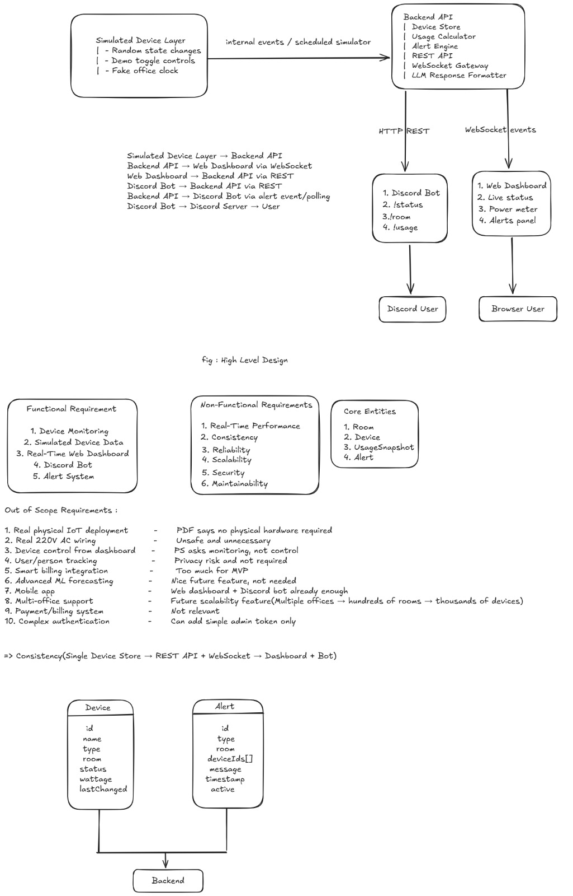
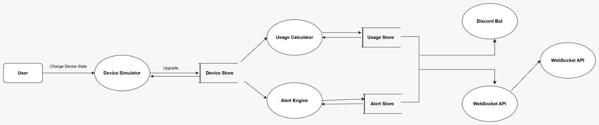
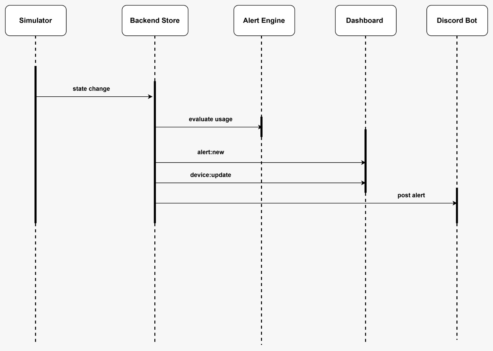
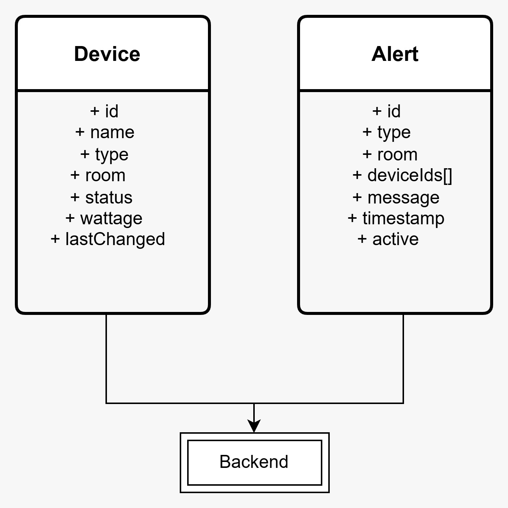
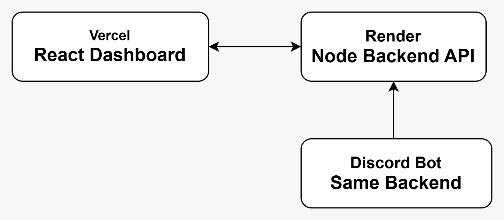

<p align="center">
  
</p>

<h1 align="center">morpheus_GUB</h1>

<p align="center">
  <em>Real-time smart-office energy monitoring for lights, fans, dashboard, Arduino simulation, and Discord.</em>
</p>

<p align="center">
  
  
  
  
  
  
  
  
</p>

<p align="center">
  <strong>15 devices. 3 rooms. One source of truth.</strong>
</p>

Real-time smart-office energy monitoring for the IUT hackathon. morpheus_GUB tracks 15 simulated electrical devices across three rooms, streams live status to a web dashboard, estimates power usage, raises energy-waste alerts, and lets the boss ask the same backend through a Discord bot.

The key idea is simple: one backend is the source of truth. The simulator, dashboard, REST API, realtime stream, Arduino-style JSON ingest, and Discord bot all read from the same live device store.

## System Diagram

<p align="center">
  
</p>

The system is built around a monitoring-first flow:

| Layer | Responsibility |
| --- | --- |
| Simulated office devices | Represents 3 rooms, each with 3 lights and 2 fans |
| Backend source of truth | Stores device state, calculates watts/kWh/cost, evaluates alerts |
| Realtime gateway | Pushes updates through SSE and native WebSocket |
| Web dashboard | Shows live room status, power meter, alerts, and simulator controls |
| Discord bot | Answers `!status`, `!room`, and `!usage` from real backend data |
| Arduino-style ingest | Accepts room snapshots from JSON shaped like circuit/sensor output |

<p align="center">
  
</p>

Supporting design artifacts:

<p align="center">
  
</p>

<p align="center">
  
</p>

<p align="center">
  
</p>

<p align="center">
  
</p>

Source diagram file: [IUT_Hackathon_System_Design.excalidraw](<docs/IUT_Hackathon_System_Design.excalidraw>)

## Arduino Circuit Diagram

The circuit design models one representative room: Work Room 1 with 3 lights and 2 fans. The real hackathon backend scales the same pattern across all three rooms.

<p align="center">
  
</p>

<p align="center">
  
</p>

Circuit PDF: [Circuit_configuration.pdf](<docs/Circuit_configuration.pdf>)

### Representative Room Wiring

| Device | Simulated hardware | Backend device ID | Rated watts |
| --- | --- | --- | ---: |
| Light 1 | LED | `work1_light_1` | 15W |
| Light 2 | LED | `work1_light_2` | 15W |
| Light 3 | LED | `work1_light_3` | 15W |
| Fan 1 | DC motor via driver/transistor | `work1_fan_1` | 60W |
| Fan 2 | DC motor via driver/transistor | `work1_fan_2` | 60W |

When all five devices are ON, the expected room draw is:

```txt
3 lights x 15W + 2 fans x 60W = 45W + 120W = 165W
```

The backend includes Arduino-style JSON ingest routes so circuit output can be tested directly:

- `POST /api/simulator/ingest`
- `POST /api/ingest/arduino`

The provided test fixture `Iut_hackathon.json` is accepted as a Work Room 1 snapshot. The backend detects the duplicate `work1_fan_1` entry, keeps one canonical device state, and still validates the expected `165W` room total.

## Backend

Backend stack:

| Area | Implementation |
| --- | --- |
| Runtime | Node.js, Express |
| Source of truth | In-memory device store |
| Realtime | SSE at `/api/stream`, WebSocket at `/ws` |
| Bot integration | `discord.js` client reading REST APIs |
| Optional AI wording | Groq formats replies only; backend owns all numbers |
| API docs | Swagger UI at `/docs` |
| Tests | `npm test` smoke suite |

### Device Model

morpheus_GUB tracks exactly 15 simulated devices:

| Room | Devices | Full-room watts |
| --- | --- | ---: |
| Drawing Room | 3 lights, 2 fans | 165W |
| Work Room 1 | 3 lights, 2 fans | 165W |
| Work Room 2 | 3 lights, 2 fans | 165W |

Device state includes:

- `id`
- `name`
- `type`
- `roomId`
- `status`
- `ratedWattage`
- `currentWattage`
- `lastChangedAt`
- accumulated kWh

### Backend Features

- Single shared backend for dashboard and Discord bot
- 15-device simulator with 10-second random state changes
- REST APIs for devices, status, rooms, usage, alerts, and snapshots
- Realtime dashboard updates through SSE and WebSocket
- After-hours alert outside configured office hours
- Continuous room usage alert when all devices in a room stay ON for more than 2 hours
- kWh and estimated BDT cost calculation
- Stable alert keys to avoid duplicate alert spam
- Demo controls for toggling devices, forcing room state, setting demo time, and resetting simulation
- Arduino-style ingest for circuit/sensor JSON

### Backend API

| Method | Endpoint | Purpose |
| --- | --- | --- |
| `GET` | `/api/health` | Backend health, metadata, realtime availability |
| `GET` | `/api/devices` | Flat list of all 15 devices |
| `GET` | `/api/status` | Office summary, grouped rooms, usage, alerts |
| `GET` | `/api/status/by-room` | Devices grouped by room |
| `GET` | `/api/rooms/:roomId` | One room report |
| `GET` | `/api/room/:name` | Backward-compatible room route |
| `GET` | `/api/usage` | Current watts, kWh, room breakdown, estimated cost |
| `GET` | `/api/alerts` | Active alerts |
| `GET` | `/api/snapshot` | Full backend state snapshot |
| `GET` | `/api/stream` | SSE realtime stream |
| `POST` | `/api/simulator/toggle/:deviceId` | Toggle one simulated device |
| `POST` | `/api/simulator/room/:roomId` | Force a full room ON/OFF |
| `POST` | `/api/simulator/ingest` | Ingest Arduino-style JSON |
| `POST` | `/api/ingest/arduino` | Alias for Arduino-style JSON ingest |
| `POST` | `/api/simulator/time` | Set demo clock for alert demos |
| `POST` | `/api/simulator/reset` | Reset simulation state |

### Run Backend

```bash
cd backend
npm install
npm run start:server
```

Development mode:

```bash
cd backend
npm run dev
```

`npm run dev` starts the backend server. It starts the Discord bot too when `DISCORD_TOKEN` is configured.

### Backend Environment

Create `backend/.env`:

```env
PORT=4000
CORS_ORIGIN=*
OFFICE_TIMEZONE=Asia/Dhaka
OFFICE_OPEN=9
OFFICE_CLOSE=17
TARIFF_BDT_PER_KWH=12
FAN_WATTS=60
LIGHT_WATTS=15
DISCORD_TOKEN=
DISCORD_ALERT_CHANNEL_ID=
GROQ_API_KEY=
GROQ_MODEL=llama-3.3-70b-versatile
```

### Backend Tests

```bash
cd backend
npm test
```

The smoke suite verifies:

- 15-device registry
- 5 devices per room
- fan/light wattage math
- accumulated kWh calculation
- after-hours alert
- continuous room alert
- Arduino-style JSON ingest
- duplicate device ID detection
- 165W Work Room 1 fixture validation

## Web Dashboard and Discord Bot Docs

The dashboard is a compact operational interface inspired by the Hermes design notes in [hermes-web-ui-design-analysis.md](<docs/System_Architecture/hermes-web-ui-design-analysis.md>). It uses a dark teal/cream monitoring aesthetic, dense room cards, power charts, active alert panels, and realtime backend synchronization.

Dashboard stack:

| Area | Implementation |
| --- | --- |
| Framework | Next.js |
| Styling | Tailwind, shadcn-style components, Base UI, Hugeicons |
| Realtime data | WebSocket/SSE plus REST resync |
| Deployment config | `vercel.json` with frontend/backend services |

Run dashboard locally:

```bash
cd frontend
npm install
npm run dev
```

The Discord bot is documented by the roadmap below and implemented in `backend/bot.js`.

<p align="center">
  
</p>

### Discord Commands

| Command | Response |
| --- | --- |
| `!status` | Office-wide room summary from live backend data |
| `!room work1` | Device status and watts for one room |
| `!usage` | Current watts, estimated kWh, cost, and room breakdown |
| `!help` | Command list |

The bot never invents energy numbers. The backend calculates all facts first. Groq is optional and only rewrites those facts into friendlier wording; if `GROQ_API_KEY` is missing or fails, deterministic template replies are used.

Run bot:

```bash
cd backend
npm run start:bot
```

## Judge Demo Script

Use this flow for a short hackathon demo:

1. Open the dashboard and show the 3 rooms with 15 total devices.
2. Open Swagger at `http://localhost:4000/docs` and show the backend APIs.
3. Toggle a device with `POST /api/simulator/toggle/:deviceId`; show the dashboard updating without refresh.
4. Set demo time to after hours:

```bash
curl -X POST http://localhost:4000/api/simulator/time \
  -H "Content-Type: application/json" \
  -d "{\"currentTime\":\"2026-07-03T22:00:00+06:00\"}"
```

5. Trigger a continuous room alert:

```bash
curl -X POST http://localhost:4000/api/simulator/room/work_room_1 \
  -H "Content-Type: application/json" \
  -d "{\"status\":\"ON\",\"onSinceHoursAgo\":3}"
```

6. Test Arduino-style JSON ingest:

```bash
curl -X POST http://localhost:4000/api/simulator/ingest \
  -H "Content-Type: application/json" \
  --data-binary "@C:/Users/User/Downloads/Iut_hackathon.json"
```

7. Ask Discord:

```txt
!status
!room work1
!usage
```

## Why This Project Wins

- It solves the actual problem: monitoring energy waste, not unnecessary remote control.
- Dashboard and bot share one backend, so judges can compare them live.
- Realtime updates prove the system works without manual refresh.
- The circuit model, backend ingest route, and JSON fixture connect the Arduino story to the software system.
- Alerts are practical: after-hours waste and rooms left fully active too long.
- The README includes architecture, circuit, backend, dashboard, bot, tests, and demo commands in one judge-friendly path.

## Documentation Index

| Asset | Purpose |
| --- | --- |
| [Smart Office Monitoring System Overview](<docs/Smart Office Monitoring System Overview.jpeg>) | High-level project overview |
| [System Design Explanation](<docs/System_Architecture/System_Design_Expalination.jpeg>) | Backend/dashboard/bot architecture |
| [IUT Hackathon Excalidraw Source](<docs/IUT_Hackathon_System_Design.excalidraw>) | Editable system design source |
| [Data Flow Diagram](<docs/Diagrams/Data_Flow_Diagram.jpeg>) | Data movement through simulator, backend, dashboard, bot |
| [Sequence Diagram](<docs/Diagrams/Sequence_Diagram.jpeg>) | Runtime event flow |
| [Mini ERD](<docs/Diagrams/Mini_ERD.jpeg>) | Device and alert data model |
| [Deployment Diagram](<docs/Diagrams/Deployment_Digram.jpeg>) | Deployment/service layout |
| [Circuit Configuration PNG](<docs/Curcite Diagram/Circuit_Configuration.png>) | Arduino circuit visual |
| [Circuit Configuration Page PNG](<docs/Curcite Diagram/Circuit_configuration-page.png>) | Circuit export page |
| [Circuit Configuration PDF](<docs/Circuit_configuration.pdf>) | Circuit document |
| [Hermes UI Design Analysis](<docs/System_Architecture/hermes-web-ui-design-analysis.md>) | Dashboard visual design notes |
| [Discord Bot Roadmap](<docs/Discord Bot Diagram/Chat App Bot Development Roadmap.jpeg>) | Bot workflow and development roadmap |
